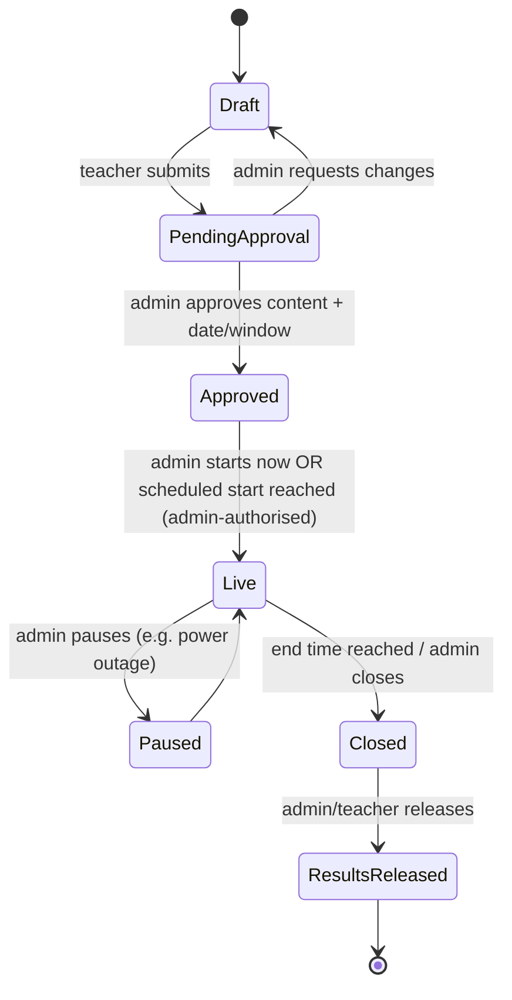

# Lekki Peculiar CBT — Product & Technical Plan

> Status: **Draft v0.1** — living document. Open questions for the school are collected in [§13](#13-open-questions-for-the-school).

---

## 1. What we're building

A web-based Computer-Based Testing (CBT) platform for one school (with room to grow to more), covering:

| Side | Who | What they do |
|---|---|---|
| **Student exam terminal** | Students (no personal portal) | Identify themselves, confirm the exam, take a timed objective test, submit. |
| **Teacher console** | Teachers (school email login) | Build question banks, configure tests/exams, submit them for approval, read organised reports. |
| **Admin console** | Admins (Heads of School / HODs) | Approve exams & dates, **start** exams, monitor live sessions, handle make-ups, manage students & teachers within their scope. |
| **Super-admin console** | School owner / IT lead | Everything, plus: school structure, admin accounts, granting permissions to admins, audit log, branding. |

All questions are **objective (multiple choice)**. That single fact simplifies a lot: grading is fully automatic, and "manual grading" becomes *score correction* (fix a wrong answer key → regrade everyone).

### Problems the school has told us about (design drivers)

1. **Disorganised reports** in their previous CBT → reports are a first-class feature, not an afterthought (see §7).
2. **Students mistyping names/IDs** → login is designed to tolerate and catch mistakes without teacher stress (see §6.1).
3. **No control over when exams run** → nobody writes until an admin approves the date *and* opens the exam (see §5).
4. **Integrity** → no changing answers after submission, re-login attempts are flagged, everything audited (see §8).
5. **Real-life exceptions** (absent students, network drops) → resume and make-up flows are designed in from day one (see §6.4, §6.5).

---

## 2. Recommended stack

| Layer | Choice | Why |
|---|---|---|
| Framework | **Next.js 15 (App Router) + TypeScript** | Native fit for Vercel; server actions/route handlers keep answer keys and grading on the server. |
| Hosting | **Vercel** | As requested. Edge caching for static assets, serverless for APIs, Cron for scheduled jobs. |
| Database / Auth / Storage | **Supabase** (Postgres) | See comparison below. |
| UI | **Tailwind CSS + shadcn/ui (Radix)** | Accessible primitives, fast to build, dark mode built in. |
| Forms & validation | React Hook Form + **Zod** | One schema validates the UI form, the upload file, and the server input. |
| Data fetching | TanStack Query | Caching, retries, optimistic updates for the exam autosave. |
| Offline resilience | Service worker (Serwist) + **IndexedDB (Dexie)** | Exam paper and answers cached locally; answers queued and synced on reconnect. |
| File imports | PapaParse (CSV), SheetJS (XLSX), custom Aiken/text parser | See §4.2. |
| Charts | Recharts | Report visualisations. |
| Math/science in questions | KaTeX (+ image upload) | Chemistry/physics/maths questions need formulas. |
| PDF output | @react-pdf/renderer | Result slips, broadsheets, certificates. |
| Email | Resend (or Supabase SMTP) | Teacher magic links, approval notifications. |
| Monitoring | Sentry + Vercel Analytics | Catch client errors during live exams. |
| Testing | Vitest (units), Playwright (end-to-end exam flow) | The exam flow must be tested under simulated network loss. |
| Tooling | pnpm, ESLint, Prettier, GitHub Actions, Supabase CLI migrations | Schema lives in the repo as SQL migrations. |

### Firebase vs Supabase → **Supabase**

| Concern | Supabase | Firebase |
|---|---|---|
| Data shape (classes ↔ subjects ↔ teachers ↔ students ↔ attempts) | Relational — natural fit, joins, foreign keys | Document store — needs denormalisation, harder to keep consistent |
| **Reports** (broadsheets, averages, item analysis) | Plain SQL / views / materialised views | Needs client-side aggregation or Cloud Functions + extra collections |
| **Row-Level Security** (explicitly requested) | Native Postgres RLS | Security Rules (capable, but not SQL; harder to audit) |
| Immutability after submit, audit trails | DB triggers, constraints | Must be built in Functions |
| Scheduled jobs (auto-close exams) | pg_cron / Vercel Cron | Cloud Scheduler |
| Live monitoring | Supabase Realtime | Firestore listeners (Firebase's strength) |
| Lock-in / portability | Standard Postgres, exportable | Proprietary |
| Cost predictability | Flat Pro plan (~$25/mo) | Per-read/write billing; a 40-question exam with autosave = many writes |

Firebase's real advantage (offline sync) is covered by our own IndexedDB queue. **Plan on Supabase Pro** for production (daily backups, point-in-time recovery option, no pausing).

---

## 3. School structure (data model backbone)

```
School (tenant)
 └─ Section            Elementary (Year 1–6)        College (Year 7–12)          ← each has own logo/branding
     └─ Stage          —                              Junior College (Y7–9) · Senior College (Y10–12)
         └─ Year       Year 1 … Year 6                Year 7 … Year 12
             └─ Class  Year 4 Gold, Year 4 Blue …    Year 10 Science A, Year 11 Commerce …
                          (arm)                        (arm + track for Senior: Science / Art / Commerce)
Academic Session (2026/2027) └─ Term (1st / 2nd / 3rd)
Subject  (Biology, French…) ── offered to Years/Tracks
Teaching Assignment = Teacher × Subject × Class × Session   ← the key join for reports & permissions
Enrolment = Student × Class × Session (+ subject choices for Senior College)
```

- Every record that matters is stamped with **session + term**, so reports stay organised year to year.
- Designed as **multi-tenant from day one** (`school_id` on every table) even though we launch with one school — cheap now, expensive to retrofit.

---

## 4. Teacher side

### 4.1 Teacher onboarding & assignments
- Login with **school email** — magic link (passwordless) as default, password optional. Only emails on the school domain (or pre-invited) are accepted.
- Teacher **requests** their assignments ("I teach Biology to Year 10 Sci A, Year 11 Sci A") → admin **approves/edits**. Admin can also assign directly. Admin always has final say.
- Dashboard: my subjects × classes, my assessments by status, upcoming approved exams, recent results.

### 4.2 Question bank & uploads
Questions live in a **question bank** per subject (tagged by year, topic, difficulty). Assessments draw from the bank, so good questions are reused across terms.

**Supported upload formats** (all validated with the same Zod schema and shown in a preview-before-import screen with per-row errors):

| Format | Who it's for | Notes |
|---|---|---|
| **Excel (.xlsx) template** ⭐ recommended default | Most teachers | Downloadable template with dropdowns for the answer column. Teachers already live in Excel. |
| **CSV** | Anyone exporting from other tools | Same columns as the template. |
| **Plain-text "Aiken" style (.txt / paste)** ⭐ easiest to type | Teachers typing in Word/Notepad | Human-readable, can be pasted straight from a Word document. |
| **JSON** | Power users, migrations from old CBT | Supports every field incl. images and explanations. |
| In-app editor | Quick edits, adding images/formulas | Rich text + KaTeX + image upload. |

Aiken-style example (what we'd recommend teachers use if they don't like spreadsheets):
```
What is the powerhouse of the cell?
A. Nucleus
B. Mitochondria
C. Ribosome
D. Golgi body
ANSWER: B
TOPIC: Cell biology
EXPLANATION: Mitochondria produce ATP.
```
CSV/XLSX columns: `question, option_a, option_b, option_c, option_d, option_e (optional), answer, topic, difficulty, explanation, image_url`.

Import features: duplicate detection, "answer column missing/invalid" errors highlighted by row, images via zip upload or URL, import into bank *or* directly into an assessment.

### 4.3 Assessment types & configuration

| Type | Default questions | Default behaviour |
|---|---|---|
| **Test** | 20 | Timed, needs approval + admin start |
| **Exam** | 40 | Timed, needs approval + admin start, strict mode |
| **Mock** | configurable | Like Exam, results may not count to term record |
| **Practice** | configurable | Can be open without admin start, instant feedback, multiple attempts |

Per-assessment settings the teacher controls (with school-wide defaults set by super admin):
- Duration; number of questions; **random N from a pool of M** (different paper per student)
- Shuffle questions / shuffle options
- **Require every question answered before submit** (on/off)
- Allow flagging for review (on/off); allow going back (on/off)
- Marks per question; pass mark
- What the student sees after submitting: nothing / score only / score + corrections
- Instructions shown on the consent screen
- Target classes (one assessment can go to several arms of the same year)

### 4.4 Assessment lifecycle

Once an assessment is **Approved**, questions are locked (a versioned snapshot is taken). Changes after that require admin re-approval — this protects integrity.

---

## 5. Admin side

### 5.1 Roles & permissions

| Role | Scope | Typical person |
|---|---|---|
| **Super admin** | Whole school | Proprietor / IT lead |
| **Admin** | A section, stage or department (e.g. "Senior College", "Science Dept") | Head of School, HOD |
| **Invigilator** *(optional role)* | Specific live exam sessions | Lab attendant, teacher on duty |
| **Teacher** | Their own teaching assignments | |
| **Student** | Their own exam attempt only | |

Admins get **granular permissions**, granted and revoked by the super admin, e.g.:
`exam.approve` · `exam.start` · `exam.pause` · `exam.grant_makeup` · `exam.extend_time` · `attempt.void` · `attempt.reset_login` · `students.manage` · `teachers.manage` · `results.release` · `reports.view_all`

(This directly implements: *"only the super admin gives admins the permission to let a student retake a missed exam."*)

### 5.2 Admin features
- **Exam calendar** — approve dates/windows; an exam cannot be taken outside an approved window. Clash detection (same class, same time).
- **Start control** — "Start now" button *or* scheduled start; either way only an admin with `exam.start` authorises it. Also Pause / Resume / Close.
- **Live monitor** (realtime) — per exam: who has logged in, who hasn't, progress (answered x/40), time left, disconnects, flags (tab-switch, second-device login). Actions: extend time for one student, unlock re-login, void attempt (with mandatory reason).
- **Make-up & exceptions** — open the exam for specific students only, in a new window, with its own expiry (see §6.5).
- **User management** — bulk import students (CSV + zip of photos named by student ID), promote classes at session end, deactivate leavers; invite/deactivate teachers; approve teacher assignment requests.
- **Attendance** — automatically derived: for each exam, who was present, absent, late, made up.
- **Results release** and **term broadsheets** across all subjects.
- **Audit log** viewer (who did what, when, from where).
- **Notifications** — email/in-app: exam submitted for approval, approved/rejected, exam starting, results released.
- **Branding** — logos per section (Elementary vs College), school colours, result-slip letterhead.

---

## 6. Student exam experience

Students have **no personal portal** — they use an **exam terminal** (a dedicated URL on lab computers or their devices).

### 6.1 Login (built to survive typos)
1. **Student ID** is the key, formatted with a **check character**, e.g. `LPS-24-0137-K`. Input is case-insensitive and ignores dashes/spaces; the check character catches most mistyped IDs *before* hitting the database ("That ID doesn't look right — check the last letter").
2. System shows **"Is this you?"** — full name, class and **photo**. Student confirms. Wrong student = cannot proceed silently.
3. Fallback for students who forget their ID: pick **Class → tap your name/photo** from the list (only enabled while an exam for that class is live, and every such login is logged).
4. Optional **exam access code** (short PIN shown on the lab screen / announced by the invigilator) so nobody outside the room can log in.
5. Student sees only exams that are **Live for their class** (or make-ups granted to them).

Printable **ID cards/slips with QR code** can be generated per class; scanning the QR fills in the ID (removes typos entirely on devices with cameras).

### 6.2 Pre-exam consent screen
Subject, class, assessment type, teacher, number of questions, duration, instructions, rules → **"I understand — Start exam"**. The clock starts on the server at this moment.

### 6.3 Exam screen
- One question at a time with **question palette** (answered / unanswered / flagged colours), Previous / Next, jump-to-number.
- **Flag for review**.
- Keyboard shortcuts: A–E to answer, N/P for next/previous, F to flag.
- **Server-authoritative timer** shown on screen; warnings at 10 and 5 minutes; auto-submit at zero.
- Submit → **review summary** (unanswered, flagged) → confirm. If "require all answered" is on, submit is blocked with a jump-to-first-unanswered link.
- Connection indicator ("All answers saved" / "Offline — answers saved on this device").
- Accessibility: large text toggle, high-contrast/dark mode, full keyboard navigation, screen-reader labels.

### 6.4 Resume after disconnection (the tricky one)
- Every answer is **saved to IndexedDB immediately** and **synced to the server** (debounced, plus a heartbeat every ~20s).
- If the internet drops, the student **keeps working**; the answers queue locally and sync on reconnect. The exam paper is downloaded at start, so no network is needed mid-exam.
- **Time is server-controlled**: `deadline = started_at + duration + granted_extra_time`. Closing the browser doesn't stop the clock (default policy; configurable).
- **Same device returns** (browser crash, refresh): resumes automatically with all answers.
- **Different device / re-login**: blocked by default → shows "Ask your invigilator". Invigilator/admin approves a **resume**, which is logged and flagged on the attempt. The admin can add compensatory time if the outage wasn't the student's fault.
- If the deadline passes while offline, whatever reached the server + whatever syncs within a short grace window (e.g. 2 min, only answers timestamped before deadline) is graded.

### 6.5 Missed exams / make-ups
- An admin with `exam.grant_makeup` selects student(s) → sets a new window (e.g. tomorrow 9:00–10:00) → reason required.
- Make-up can use the **same paper** or a **fresh random draw** from the pool (recommended, so the student can't be told the questions).
- Make-up attempts are marked as such in reports and attendance.

---

## 7. Reports (the big complaint — designed first, not last)

All reports are filterable by **Session → Term → Class → Subject → Assessment type**, exportable to **Excel / CSV / PDF**, and print cleanly.

Using the school's example — *Mr Dixon teaches Charles Biology, French and Chemistry*:

| View | Answers the question | Contents |
|---|---|---|
| **A. Assessment result** (per subject, per exam) | "How did Year 10A do in the Biology mid-term?" | All students' scores, rank, pass/fail, time taken, attendance; stats: mean, median, highest, lowest, pass rate, score distribution chart. |
| **B. Item analysis** (per exam) | "Which questions did they fail/miss?" | For each question: % correct, % unanswered, **which wrong option was most chosen** (reveals misconceptions or a wrong answer key), difficulty index. One-click "fix answer key → regrade". |
| **C. Subject over term** | "Biology across all tests this term" | Student × assessment grid for one subject, with term average. |
| **D. Teacher broadsheet (combined)** | "All my subjects for this class" | Rows = students, columns = Biology / French / Chemistry (only subjects *this teacher* teaches that class), plus average. |
| **E. Student profile (under a teacher)** | "How is Charles doing with me?" | Charles's scores in all of Dixon's subjects over time, trend chart, list of questions he got wrong/missed per exam. |
| **F. Admin broadsheet** | "Whole-class term result" | Every subject for a class; positions; exportable as the school's result sheet. |
| **G. Integrity report** | "Anything suspicious?" | Flags per attempt: tab switches, re-logins, device changes, unusually fast completion, identical answer patterns between neighbours. |

Teachers only see data for their assignments (enforced by RLS, not just the UI). Heavy aggregates are served from SQL views / materialised views refreshed when an exam closes, so reports stay fast.

---

## 8. Security & integrity

| Threat | Mitigation |
|---|---|
| Answer key leaks to the browser | Correct answers **never** sent to the client; grading happens in the database/server only. |
| Changing answers after submit | `submitted_at` set once; DB trigger + RLS make submitted attempts and their answers **immutable**. |
| Starting early / outside window | Server checks exam status + window + student eligibility on every request, not just in the UI. |
| Logging in twice / on another device | One active session token per attempt; a second login is blocked, **flagged** and logged; requires admin/invigilator unlock. |
| Copying from neighbours | Question & option shuffling per student; random draw from larger pools; answer-pattern similarity check in integrity report. |
| Leaving the exam tab | "Lockdown-lite": fullscreen request, blur/tab-switch/copy/right-click detection → logged as flags (browsers can't fully lock down; a Safe Exam Browser config is a later option for lab machines). |
| Staff overreach | Granular permissions, scoped admins, every privileged action in an **append-only audit log** (who, what, before/after, IP, time). |
| Data loss | Supabase daily backups (+ PITR), soft deletes only for academic records, exports. |
| Student data (minors) | Photos in private storage bucket with signed URLs; access limited to staff with scope; aligned with the **Nigeria Data Protection Act 2023**; data retention policy agreed with the school. |

Student auth detail: students are not Supabase Auth users. The server verifies ID (+ access code) and issues a short-lived, httpOnly **attempt token** bound to the attempt and device. All student reads/writes go through server endpoints / Postgres functions that check that token — students have no direct table access at all.

---

## 9. Data model (first cut)

```
schools, sections, stages, years, classes, tracks, academic_sessions, terms
subjects, subject_offerings (subject × year/track)
profiles (staff: super_admin | admin | teacher | invigilator), admin_scopes, permissions, permission_grants
teaching_assignments (teacher × subject × class × session, status: requested|approved)
students (student_code, check_char, names, photo_path, status), enrolments (student × class × session), student_subjects
question_banks, questions, question_options, question_media, question_tags
assessments (type, settings JSON, status, created_by), assessment_classes, assessment_versions (frozen snapshot)
exam_windows (assessment × class, starts_at, ends_at, approved_by, started_by, status)
exam_exceptions (make-ups / extra time: student × window, granted_by, reason, expires_at)
attempts (student × window, question_order, started_at, deadline, submitted_at, score, status, device_id, is_makeup)
attempt_answers (attempt × question, selected_option, answered_at, synced_at)
attempt_events (login, resume, focus_lost, fullscreen_exit, flag, submit…)
notifications, audit_log, branding_settings
views: v_assessment_results, v_item_analysis, v_teacher_broadsheet, v_class_broadsheet, v_student_profile
```

---

## 10. Scope: what's in, what's later, what we'd push back on

From the feature list in the proposal, mapped to phases:

| Feature | Phase | Note |
|---|---|---|
| Secure auth, role-based access | **1** | Staff email login + student ID terminal. |
| Elementary / College sections, logos, subject divisions | **1** | Core structure. |
| Tests (20) / Exams (40) / Practice | **1** (practice in 2) | Defaults, all configurable. |
| Exam creation & management, question bank, uploads | **1** | |
| Scheduling + admin start + approval | **1** | Core requirement. |
| Auto grading | **1** | Objective only. |
| "Manual grading" | **1** | As answer-key correction + regrade, and score override with reason. |
| Resume after disconnect, offline resilience | **1** | Offline *during* an exam; starting still needs the server. |
| Cross-platform delivery | **1** | Responsive web/PWA: lab PCs, laptops, tablets. |
| Reports A–F, exports | **1–2** | A, B, D, E in phase 1. |
| Audit trail, secure results | **1** | |
| Live monitoring, make-ups, extra time | **2** | (Make-up basic grant in phase 1 if exams start early.) |
| Notifications, attendance | **2** | |
| Accessibility, dark mode | **2** | Built on accessible components from day one; audited in phase 2. |
| Certificates, result slips (PDF) | **2** | |
| Browser lockdown | **2 (lite)** | Safe Exam Browser config for lab PCs = option. |
| Leaderboards, gamification | **3** | Practice mode only — rankings on real exams can hurt younger pupils. |
| Adaptive learning | **3** | Practice mode, driven by item-analysis data. |
| Multi-language UI | **3** | English first; French interface possible later. |
| LMS integration | **3** | Only if the school uses one (Google Classroom?). |
| Multitenancy | **Designed in 1, exposed in 3** | `school_id` everywhere from the start. |
| **AI (webcam) proctoring** | ⚠️ Not recommended now | Invasive for minors, bandwidth-heavy, needs consent; invigilated labs + integrity flags cover most of the risk. Revisit if remote exams are needed. |
| **Plagiarism detection** | ⚠️ Replaced | Not meaningful for MCQs; replaced by **answer-pattern collusion detection** (report G). |

---

## 11. Delivery plan

| Phase | Goal | Contents |
|---|---|---|
| **0 — Foundations** (~1 wk) | Skeleton everyone builds on | Next.js + Supabase projects, CI, migrations, RLS baseline, seed data (sections, years, subjects), design system & branding, auth for staff. |
| **1 — MVP: run a real exam** (~5–6 wks) | A teacher can set a test, admin approves & starts it, a class takes it, teacher sees organised results | School structure admin, students import w/ photos, teacher assignments, question bank + imports, assessment builder & settings, approval + windows + start, student terminal (login, consent, exam, autosave, resume, submit), grading, reports A/B/D/E, audit log. |
| **Pilot** (~1 wk) | Prove it in the lab | One class, one subject, low stakes; load test (e.g. 300 simulated concurrent students); fix. |
| **2 — School-wide rollout** (~4 wks) | Run end-of-term exams | Live monitor, make-ups/extra time UI, practice mode, notifications, attendance, broadsheets C/F, integrity report G, PDF slips/certificates, lockdown-lite, accessibility & dark mode audit. |
| **3 — Enhancements** | Nice-to-haves | Leaderboards/gamification, adaptive practice, multi-language, LMS integration, multi-school. |

Timelines are rough and assume one to two developers; we'll refine once open questions are answered.

---

## 12. Proposed repo layout

```
/app
  (staff)/            teacher & admin consoles (auth required)
  (exam)/             student exam terminal (attempt-token only)
  api/                route handlers (import, exam sync, exports)
/components           shared UI (shadcn-based)
/lib                  supabase clients, zod schemas, parsers (csv/xlsx/aiken/json), grading
/supabase
  migrations/         SQL schema, RLS policies, triggers, views
  seed.sql
/tests                vitest + playwright (incl. offline/resume scenarios)
/docs                 this plan, ADRs, question-upload guide for teachers
```

---

## 13. Open questions for the school

1. **Devices & network:** Exams in a computer lab, on students' own devices, or both? How reliable is the lab internet? (Decides how hard we lean on offline mode and whether a local-network fallback is worth considering.)
2. **Numbers:** Total students, and the largest number sitting an exam at the same time?
3. **Timer policy on disconnect:** Keep running (our default) or pause until the student is back?
4. **Results visibility:** Should students see scores/corrections right after submitting, or only after release?
5. **Admin scoping:** Are HODs scoped by department (Science/Art/Commerce), by section (Elementary/College), or both?
6. **Class naming:** What are the actual arm names (e.g. Year 7 Gold/Blue, JSS1A)? Do Senior College students take different subject combinations per track?
7. **Student IDs:** Do students already have admission numbers we should reuse? Is there a photo archive to import?
8. **Question content:** Do questions need images, diagrams, formulas (chemistry/maths)? Any audio (French listening)?
9. **Grading output:** Do CBT scores feed into a larger term result (CA + exam weighting)? Does the school need the broadsheet in a specific format?
10. **Teacher login:** Does the school use Google Workspace or Microsoft 365? (We can add "Sign in with Google/Microsoft".)
11. **Penalties:** What should happen to a flagged student — automatic mark-down, or admin review only? (We recommend admin review only.)
12. **Invigilators:** Are exams invigilated by teachers who should get a limited "invigilator" role?
